# WEATHER-FISH — System Diagrams
**OTH Amberg-Weiden · AI-Driven Adaptive Weather Narration**

---

## Diagram 1 — Entity Relationship: Team Contributions & Ownership

```mermaid
erDiagram

    %% ── Team Members ──────────────────────────────────────────
    FENIL_RAMANI {
        string role          "Project Lead"
        string domain        "AI · Architecture · Auth · Deployment"
        string email         "f.ramani@oth-aw.de"
    }
    PRASAD_RAJYGURU {
        string role          "Frontend Engineer"
        string domain        "UI/UX · Audio · Components · Responsive"
    }
    SHUBHAM_KUSHWAHA {
        string role          "Backend Engineer"
        string domain        "REST API · Scheduler · Storage · Weather"
    }

    %% ── System Modules ────────────────────────────────────────
    AI_ENGINE {
        string models        "Gemini 2.5/2.0/1.5 — 6-model fallback"
        string presenters    "Fisch · Merkel · Haftbefehl"
        int    languages     2
        string fallback      "Template report (no API needed)"
    }
    CONTEXT_ENGINE {
        string input         "current + hourly weather data"
        string output        "severity · time_of_day · tone · highlights"
        string file          "src/ai/context_engine.py"
    }
    TTS_MODULE {
        string engine        "Microsoft Edge-TTS (Neural)"
        string voices        "DE + EN per presenter"
        int    mp3_per_gen   6
        string naming        "Presenter_lang.mp3"
    }
    AUTH_SYSTEM {
        string method        "JWT (PyJWT) + bcrypt"
        string token_expiry  "30 days"
        string storage       "MongoDB users collection"
        string activity_log  "user_activities collection"
    }
    PROMPT_ENGINEERING {
        string personas      "3 distinct character voices"
        string adaptation    "context-driven tone + severity"
        string languages     "German + English simultaneous"
    }
    DEPLOYMENT {
        string host          "HuggingFace Spaces"
        string secrets       "GEMINI_KEY · OW_KEY · MONGO_URI · JWT_SECRET"
        string build         "Vite dist served via FastAPI StaticFiles"
    }
    DB_SCHEMA_DESIGN {
        string collections   "6 MongoDB collections"
        string key_design    "Composite (presenter + language)"
        string caching       "20-min TTL on ai_reports"
        string history       "90-day rolling weather_history"
    }

    %% ── Prasad's Modules ──────────────────────────────────────
    REACT_FRONTEND {
        string framework     "React 18 + TypeScript + Vite 6"
        string design        "German Bauhaus dark — Gold/Black"
        string fonts         "Oswald · Inter · JetBrains Mono"
        int    pages         6
    }
    MASCOT_SYSTEM {
        string mascots       "mascotfish · mascotmerkel · mascothaftbefehl"
        string format        "SVG presenter cards + selector"
    }
    AUDIO_PLAYER {
        string features      "Auto-play · Stop · Wave animation"
        string format        "HTML5 audio + polling hook"
    }
    MOBILE_NAV {
        string type          "Hamburger + slide-in drawer"
        string breakpoint    "640px"
        string animation     "CSS transform translateX"
    }
    REPORTS_PAGE {
        string features      "DE/EN toggle · Presenter selector"
        string polling       "2s interval · 40 max polls"
        string suggestions   "Weather-based activity tips"
    }

    %% ── Shubham's Modules ─────────────────────────────────────
    FASTAPI_BACKEND {
        string framework     "FastAPI + Uvicorn"
        int    endpoints     15
        string port_dev      "8000"
        string port_hf       "7860"
    }
    APSCHEDULER {
        string type          "BackgroundScheduler (APScheduler)"
        string interval      "Hourly auto-generation"
        string timezone      "UTC"
    }
    WEATHER_PIPELINE {
        string source        "OpenWeather API (current + 5-day)"
        string geocoding     "OpenWeather Geo API"
        string output        "DataFrame → structured JSON"
    }
    MONGODB_LAYER {
        string driver        "pymongo 4.7.3"
        string host          "Atlas M0 free tier"
        int    collections   6
        string ops           "upsert · find · insert · delete"
    }

    %% ── Fenil owns ────────────────────────────────────────────
    FENIL_RAMANI ||--|| AI_ENGINE           : "built + engineered"
    FENIL_RAMANI ||--|| CONTEXT_ENGINE      : "designed + implemented"
    FENIL_RAMANI ||--|| TTS_MODULE          : "integrated"
    FENIL_RAMANI ||--|| AUTH_SYSTEM         : "designed + built"
    FENIL_RAMANI ||--|| PROMPT_ENGINEERING  : "owns"
    FENIL_RAMANI ||--|| DEPLOYMENT          : "owns"
    FENIL_RAMANI ||--|| DB_SCHEMA_DESIGN    : "owns"

    %% ── Prasad owns ───────────────────────────────────────────
    PRASAD_RAJYGURU ||--|| REACT_FRONTEND   : "built + designed"
    PRASAD_RAJYGURU ||--|| MASCOT_SYSTEM    : "built"
    PRASAD_RAJYGURU ||--|| AUDIO_PLAYER     : "built"
    PRASAD_RAJYGURU ||--|| MOBILE_NAV       : "built"
    PRASAD_RAJYGURU ||--|| REPORTS_PAGE     : "built"

    %% ── Shubham owns ──────────────────────────────────────────
    SHUBHAM_KUSHWAHA ||--|| FASTAPI_BACKEND  : "implemented"
    SHUBHAM_KUSHWAHA ||--|| APSCHEDULER      : "configured"
    SHUBHAM_KUSHWAHA ||--|| WEATHER_PIPELINE : "integrated"
    SHUBHAM_KUSHWAHA ||--|| MONGODB_LAYER    : "implemented"

    %% ── Cross-team integration ────────────────────────────────
    FENIL_RAMANI    }o--o{ PRASAD_RAJYGURU  : "report endpoint contract + audio naming"
    FENIL_RAMANI    }o--o{ SHUBHAM_KUSHWAHA : "pipeline orchestration + auth endpoints"

    %% ── Module relationships ──────────────────────────────────
    CONTEXT_ENGINE      ||--|| AI_ENGINE           : "feeds adaptive tone"
    AI_ENGINE           ||--|{ TTS_MODULE           : "text → audio"
    DB_SCHEMA_DESIGN    ||--|| MONGODB_LAYER        : "schema implemented by"
    FASTAPI_BACKEND     ||--|| MONGODB_LAYER        : "reads + writes"
    FASTAPI_BACKEND     ||--|| WEATHER_PIPELINE     : "triggers"
    FASTAPI_BACKEND     ||--|| AI_ENGINE            : "orchestrates via api.py"
    FASTAPI_BACKEND     ||--|| AUTH_SYSTEM          : "exposes endpoints"
    APSCHEDULER         ||--|| FASTAPI_BACKEND      : "calls hourly"
    REACT_FRONTEND      ||--|| FASTAPI_BACKEND      : "REST API (fetch)"
    REACT_FRONTEND      ||--|| AUTH_SYSTEM          : "JWT in localStorage"
    REPORTS_PAGE        ||--|| AUDIO_PLAYER         : "uses"
    REPORTS_PAGE        ||--|| MASCOT_SYSTEM        : "uses"
```

---

## Diagram 2 — Full System Flowchart

```mermaid
flowchart TD

    %% ── Entry points ──────────────────────────────────────────
    USER(["👤 User\n(authenticated via JWT)"])
    SCHED(["⏰ APScheduler\nHourly auto-job\n— Shubham"])

    %% ── Input & Auth ──────────────────────────────────────────
    USER --> LOGIN["🔐 Login / Register\nJWT issued on success\n— Fenil"]
    LOGIN --> INPUT["Enter Postal Code\nor City Name\n— Prasad UI"]
    SCHED --> GEO

    %% ── Geocoding ─────────────────────────────────────────────
    INPUT --> GEO["📍 Geocoding\nOpenWeather Geo API\n→ lat, lon\n— Shubham"]
    GEO --> VALID{Valid\ncoordinates?}
    VALID -- No --> ERR1(["❌ Error shown\nin dashboard"])
    VALID -- Yes --> WEATHER

    %% ── Weather fetch ─────────────────────────────────────────
    WEATHER["🌤️ OpenWeather API\ncurrent + 5-day 3h forecast\n→ DataFrames\n— Shubham"]
    WEATHER --> SAVE_W["💾 Save to MongoDB\nweather_snapshots\n— Shubham"]
    WEATHER --> CTX

    %% ── Context engine ────────────────────────────────────────
    CTX["⚙️ Context Engine\nSeverity · Time of day\nHighlights · Narrative tone\n— Fenil"]
    CTX --> CACHE_CHK

    %% ── Cache check ───────────────────────────────────────────
    CACHE_CHK{"📦 MongoDB cache hit?\nai_reports\n< 20 min old\n+ same location?"}
    CACHE_CHK -- Yes --> SERVE_CACHE["⚡ Load from cache\nskip Gemini entirely"]
    CACHE_CHK -- No --> PARALLEL

    %% ── Parallel AI generation ────────────────────────────────
    PARALLEL["🔀 Parallel Generation\nThreadPoolExecutor\n3 presenters × 2 languages\n= 6 tasks concurrent\n— Fenil"]

    PARALLEL --> F_DE["Fisch\n🇩🇪 DE"]
    PARALLEL --> F_EN["Fisch\n🇬🇧 EN"]
    PARALLEL --> M_DE["Merkel\n🇩🇪 DE"]
    PARALLEL --> M_EN["Merkel\n🇬🇧 EN"]
    PARALLEL --> H_DE["Haftbefehl\n🇩🇪 DE"]
    PARALLEL --> H_EN["Haftbefehl\n🇬🇧 EN"]

    %% ── Gemini fallback chain (one representative shown) ──────
    F_DE --> GEMINI["🤖 Gemini Fallback Chain\n2.5-flash-preview → 2.5-flash\n→ 2.0-flash → 2.0-flash-lite\n→ 1.5-flash-001 → 1.5-flash-8b\n— Fenil"]
    F_EN --> GEMINI
    M_DE --> GEMINI
    M_EN --> GEMINI
    H_DE --> GEMINI
    H_EN --> GEMINI

    GEMINI --> GEMINI_OK{Any model\nsucceeded?}
    GEMINI_OK -- Yes --> SAVE_R
    GEMINI_OK -- No --> TEMPLATE["📄 Template Fallback\nStructured text\nfrom weather data\nno API needed\n— Fenil"]
    TEMPLATE --> SAVE_R

    %% ── Save reports ──────────────────────────────────────────
    SERVE_CACHE --> TTS
    SAVE_R["💾 Save to MongoDB\nai_reports\n(presenter, language) key\n— Fenil schema / Shubham ops"]
    SAVE_R --> TTS

    %% ── TTS ───────────────────────────────────────────────────
    TTS["🔊 Edge-TTS Generation\nParallel — 6 MP3 files\nFisch_de · Fisch_en\nMerkel_de · Merkel_en\nHaftbefehl_de · Haftbefehl_en\n— Fenil"]
    TTS --> ACTIVITY

    %% ── Activity logging ──────────────────────────────────────
    ACTIVITY["📊 Log User Activity\ncity + hobbies + timestamp\n→ user_activities\n— Fenil"]
    ACTIVITY --> FRONTEND

    %% ── Frontend rendering ────────────────────────────────────
    FRONTEND["⚛️ React Frontend\nFastAPI serves Vite build\n— Prasad"]
    FRONTEND --> DASH["🏠 Dashboard\nCurrent weather cards\nlive data"]
    FRONTEND --> REPORTS["📻 Reports Page\nPresenter selector\nDE/EN toggle\n— Prasad"]
    FRONTEND --> CHAT["💬 AI Chat\nContext-grounded\nGemini replies\n— Fenil"]
    FRONTEND --> PROFILE["👤 Profile Page\nActivity timeline\nStats · Hobby prefs\n— Fenil"]
    FRONTEND --> FORECAST["📊 Forecast\nHourly + Weekly\n— Prasad"]

    REPORTS --> AUDIO["▶ Audio Playback\nNeural voice MP3\nauto-play option\n— Prasad"]
    REPORTS --> TOGGLE["🇩🇪 🇬🇧 Language Toggle\nDE / EN switch\n— Prasad"]

    %% ── Styling ───────────────────────────────────────────────
    style USER       fill:#1a3050,stroke:#607898,color:#eaf1f8
    style SCHED      fill:#1a3050,stroke:#607898,color:#eaf1f8
    style LOGIN      fill:#0f1828,stroke:#d4b45a,color:#d4b45a
    style GEMINI     fill:#152030,stroke:#d4b45a,color:#eaf1f8
    style CTX        fill:#152030,stroke:#d4b45a,color:#eaf1f8
    style PARALLEL   fill:#152030,stroke:#d4b45a,color:#eaf1f8
    style TTS        fill:#152030,stroke:#d4b45a,color:#eaf1f8
    style TEMPLATE   fill:#1a2030,stroke:#607898,color:#9eb8d0
    style CACHE_CHK  fill:#0f1828,stroke:#607898,color:#eaf1f8
    style GEMINI_OK  fill:#0f1828,stroke:#607898,color:#eaf1f8
    style VALID      fill:#0f1828,stroke:#607898,color:#eaf1f8
    style FRONTEND   fill:#0f2840,stroke:#9eb8d0,color:#eaf1f8
    style REPORTS    fill:#0f2840,stroke:#9eb8d0,color:#eaf1f8
    style AUDIO      fill:#0f2840,stroke:#9eb8d0,color:#eaf1f8
```



---

## Diagram 3 — Team Integration Map

```mermaid
graph TB

    subgraph FENIL ["🟡 Fenil Ramani — Project Lead"]
        direction TB
        F1["🤖 AI Engine\nGemini fallback chain"]
        F2["⚙️ Context Engine\nAdaptive tone"]
        F3["🔊 Edge-TTS\nNeural voices DE+EN"]
        F4["🔐 Auth System\nJWT + bcrypt + profiles"]
        F5["🚀 HuggingFace Deployment\nSecrets · Build pipeline"]
        F6["🗄️ DB Schema Design\n6 collections · caching strategy"]
        F7["✍️ Prompt Engineering\n3 personas · bilingual"]
    end

    subgraph PRASAD ["🔵 Prasad Rajyguru — Frontend Engineer"]
        direction TB
        P1["🎨 React Dashboard\nBauhaus dark theme"]
        P2["🐟 Mascot Presenter System\nFisch · Merkel · Haftbefehl"]
        P3["🎵 Audio Player\nAuto-play · wave animation"]
        P4["📱 Mobile Navigation\nHamburger drawer"]
        P5["📻 Reports Page\nDE/EN toggle · polling"]
        P6["📊 Forecast + Dashboard\nWeather cards · charts"]
    end

    subgraph SHUBHAM ["🟢 Shubham Kushwaha — Backend Engineer"]
        direction TB
        S1["⚡ FastAPI REST API\n15 endpoints"]
        S2["⏰ APScheduler\nHourly auto-generation"]
        S3["🌤️ OpenWeather Pipeline\nGeocoding + weather data"]
        S4["🍃 MongoDB Operations\npymongo CRUD"]
    end

    %% ── Integration interfaces ────────────────────────────────
    INT_FP(["🤝 Fenil ↔ Prasad\nIntegration"])
    INT_FS(["🤝 Fenil ↔ Shubham\nIntegration"])

    INT_FP --> IFP1["Report endpoint contract\nGET /api/report/presenter?lang="]
    INT_FP --> IFP2["Audio file naming\nPresenter_lang.mp3"]
    INT_FP --> IFP3["Context highlights → UI\nSuggestions grid"]
    INT_FP --> IFP4["Auth token → fetch headers\nAuthorization: Bearer"]

    INT_FS --> IFS1["Pipeline orchestrator\napi.get_all_weather_data()"]
    INT_FS --> IFS2["Auth endpoints in main.py\nregister · login · me · profile"]
    INT_FS --> IFS3["Scheduler calls Fenil's pipeline\n_scheduled_generation()"]
    INT_FS --> IFS4["DB schema → pymongo ops\nupsert_report(presenter, lang)"]

    FENIL ===|"UI contract"| INT_FP
    PRASAD ===|"consumes"| INT_FP
    FENIL ===|"pipeline"| INT_FS
    SHUBHAM ===|"implements"| INT_FS

    %% ── Styles ────────────────────────────────────────────────
    style FENIL   fill:#1a1408,stroke:#d4b45a,color:#e8c878
    style PRASAD  fill:#08101a,stroke:#4a8fc0,color:#9eb8d0
    style SHUBHAM fill:#081408,stroke:#4a9050,color:#80c090
    style INT_FP  fill:#0f0f20,stroke:#9070c0,color:#c0a0e0
    style INT_FS  fill:#0f0f20,stroke:#9070c0,color:#c0a0e0
```



---

*Generated: June 2026 · WEATHER-FISH · OTH Amberg-Weiden*
*Preview: VS Code → Cmd/Ctrl+Shift+V (with Markdown Preview Mermaid Support extension)*
